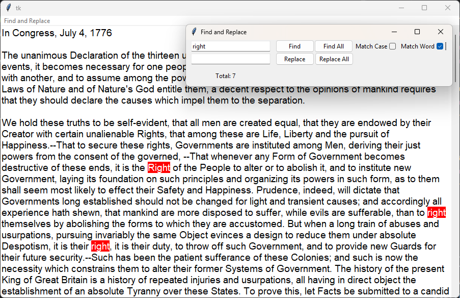
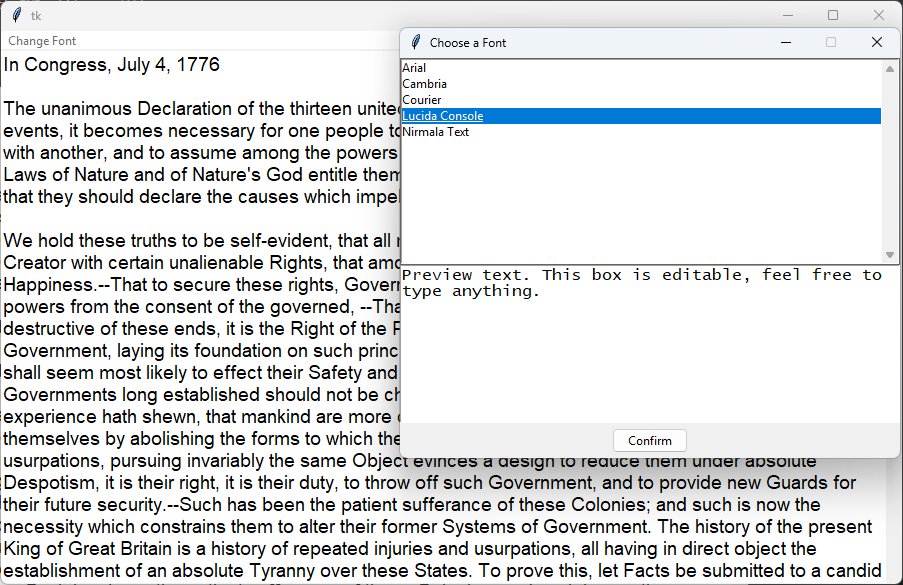
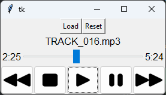

# KitchTk: A Collection Widgets and Dialogs

A collection of miscellaneous dialogs and widgets for Tkinter that I have created over the years.

---

### Find and Replace

Provides a Find and Replace widget that can be embedded in a Tkinter app, as well as a standalone dialog.

#### Usage

```python
# Widget version
from find_and_replace_widget import FindReplaceWidget

find_rep = FindReplaceWidget(parent, text_widget: tk.Text)
find_rep.find()            # GUI action to find all words in self.text_widget and mark the first instance
find_rep.find_all()        # GUI action to find all words in self.text_widget and show all instances
find_rep.replace()         # GUI action to replace the first selected word. Re-finds all words afterward.
find_rep.replace_all()     # GUI action to replace all found words.
find_rep.next_instance()   # GUI action to select the next instance. Wraps to the first instance if the last is selected
find_rep.previous_instance() # GUI action to select the previous instance. Wraps back to the last instance if the first is selected.


# Dialog
from find_rep_dialog import FindReplaceDialog

find_rep_dialog = FindReplaceDialog(text_widget: tk.Text)
find_rep_dialog.show()     # Shows the dialog
find_rep_dialog.destroy()  # Closes the dialog and resets the tk.Text object to its original state
```

#### Example App

```python
import tkinter as tk
from find_rep_dialog import FindReplaceDialog

root = tk.Tk()
editor = tk.Text(root, wrap=tk.WORD, font=('Arial', 14))
scrollbar = tk.Scrollbar(root, command=editor.yview, cursor='arrow')
editor.configure(yscrollcommand=scrollbar.set, relief=tk.FLAT)

find_rep_dialog = FindReplaceDialog(editor)

menubar = tk.Menu(root)
menubar.add_command(label="Find and Replace", command=find_rep_dialog.show)

root.configure(menu=menubar)
scrollbar.pack(side=tk.RIGHT, fill=tk.BOTH)
editor.pack(fill=tk.BOTH, expand=True)

with open("../DOI.txt", 'r') as file:
    editor.insert(tk.END, file.read())

root.mainloop()
```



---

### Font Chooser

Provides a font chooser widget that can be embedded in a Tkinter app, as well as a standalone dialog.

#### Usage

```python
# Widget version
from font_chooser_widget import FontChooserWidget

"""
If 'current_font' is not None, the widget will attempt to set the initial selection to that font.
If 'font_list' is provided, the font chooser will only display those fonts.
Otherwise, it will list all fonts available on the system.
"""
font_chooser = FontChooserWidget(parent, current_font=None, font_list=None)
font_chooser.get_font() # Returns the chosen font name as a string. Returns an empty string if no font was selected.


# Dialog
from font_chooser_dialog import FontChooserDialog

font_chooser_dialog = FontChooserDialog(current_font=None, font_list=None)
font_chooser_dialog.get_font() # Shows the dialog and returns the chosen font. Returns an empty string if no font was selected.
```

#### Example App

```python
import tkinter as tk
from font_chooser_dialog import FontChooserDialog

class SimpleEditor(tk.Frame):
    def __init__(self, *args, **kwargs):
        super().__init__(*args, **kwargs)
        self.allowed_fonts = ['Arial', 'Cambria', 'Courier', 'Lucida Console', 'Nirmala Text']
        self.font_family = 'Arial'
        self.editor = tk.Text(root, wrap=tk.WORD, font=(self.font_family, 14))
        self.scrollbar = tk.Scrollbar(root, command=self.editor.yview, cursor='arrow')
        self.editor.configure(yscrollcommand=self.scrollbar.set, relief=tk.FLAT)
        self.scrollbar.pack(side=tk.RIGHT, fill=tk.BOTH)
        self.editor.pack(fill=tk.BOTH, expand=True)

        with open("../DOI.txt", 'r') as file:
            self.editor.insert(tk.END, file.read())

    def change_font(self):
        dialog = FontChooserDialog(current_font=self.font_family, font_list=self.allowed_fonts)
        new_font = dialog.get_font()
        if new_font:
            self.font_family = new_font
            self.editor.configure(font=(new_font, 14))

root = tk.Tk()
editor = SimpleEditor(root)
menubar = tk.Menu(root)
menubar.add_command(label="Change Font", command=editor.change_font)
editor.pack()
root.configure(menu=menubar)
root.mainloop()
```



---

### MP3 Player

Requires:
- **Pillow v10.4** (for displaying icons)  
- **just_playback v0.1.8**

A widget for controlling playback of an MP3 file. A free icon set is included, but you can easily point the class to your own set:

```python
class MP3Player(tk.Frame):
    def __init__(self, text_font: font = None, *args, **kwargs):
        tk.Frame.__init__(*args, **kwargs)

        # Icon paths - Feel free to point to your own icon set if desired
        rewind = "path to icon"
        stop = "path to icon"
        play = "path to icon"
        pause = "path to icon"
        fast_forward = "path to icon"
        self.icon_size = (45, 38) # (width, height)
```

#### Usage

```python
from mp3_player import MP3Player

"""
MP3Player is a child of tk.Frame and accepts the same arguments as tk.Frame.
If 'text_font' is not None, the widget will use that font. Must be a tkinter font object
or a tuple[str, int].
"""
player = MP3Player(text_font: font | tuple[str, int] = None)

player.load(filepath: str)         # Loads the MP3 file at filepath
player.reset_state()               # Resets the state of the widget. Does nothing if no file is loaded
player.play()                      # Plays the loaded MP3
player.pause()                     # Pauses playback
player.stop()                      # Stops playback and resets the player state
player.rewind(interval=4)          # Rewinds the MP3 by 'interval' seconds
player.fast_forward(interval=4)    # Fast-forwards the MP3 by 'interval' seconds
```

#### Example App

```python
import tkinter as tk
from tkinter import filedialog
from mp3_player import MP3Player

main_win = tk.Tk()
player = MP3Player(('Helvetica', 12), master=main_win)

butt_frame = tk.Frame(main_win)
btn_load = tk.Button(butt_frame, text="Load",
                     command=lambda: player.load(filedialog.askopenfilename(filetypes=[("MP3 files", "*.mp3")])))
btn_reset = tk.Button(butt_frame, text="Reset", command=player.reset_state)

butt_frame.pack()
btn_load.pack(side=tk.LEFT)
btn_reset.pack(side=tk.LEFT)
player.pack()

main_win.mainloop()
```


